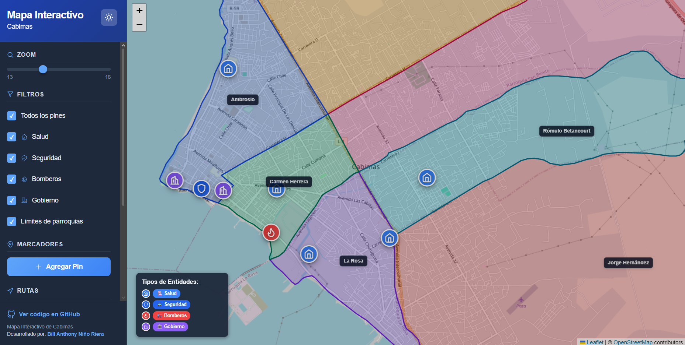

# Mapa Interactivo de Cabimas



Una aplicación web que muestra un mapa interactivo offline de Cabimas con ubicaciones de las entidades publicas de Cabimas.

## Características

- Mapa offline usando tiles descargados
- Filtro para alternar entre todos los servicios o los servicios de salud, seguridad, bomberos y gobierno
- Marcadores con íconos personalizados: 🏥 (azul claro) para salud, 🚓 (azul) para seguridad, 🚒 (rojo claro) para bomberos, 🏛️ (morado) para gobierno
- Pin personalizable y arrastrable para obtener coordenadas
- Ubicación en tiempo real del usuario (GPS del navegador)
- Zoom limitado entre 13 y 16
- Navegación restringida al área de Cabimas

## Tecnologías

- Next.js
- React
- Leaflet
- React-Leaflet

## Instalación

1. Clona el repositorio
2. Navega a la carpeta `frontend`
3. Ejecuta `npm install`
4. Ejecuta `npm run dev`
5. Abre [http://localhost:3000](http://localhost:3000) en tu navegador

## Uso

- Usa los botones de filtro en la parte izquierda para alternar entre "Todos los pines", "Salud", "Seguridad", "Bomberos" y "Gobierno"
- Haz zoom y navega por el mapa de Cabimas
- Haz clic en los pines para ver información
- Usa el botón "Agregar Pin" para colocar un marcador personalizable; cambia a "Eliminar Pin" para removerlo
- Arrastra el pin personalizado para actualizar coordenadas en tiempo real
- Usa "Mi ubicación" para mostrar tu posición con el GPS del navegador; el punto azul se actualiza en tiempo real. El mapa pedirá permiso de ubicación.

## Enlaces de las entidades

Los archivos `frontend/data/hospitales.json`, `seguridad.json`, `bomberos.json` y
`gobierno.json` admiten una página web y varias redes sociales por entidad. Los
enlaces aparecen en el popup del marcador cuando tienen una URL `http` o `https`:

```json
"paginaWeb": "https://ejemplo.org",
"redesSociales": [
  { "nombre": "Instagram", "url": "https://instagram.com/ejemplo" }
]
```
